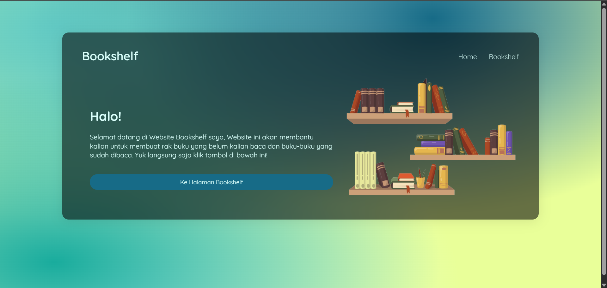
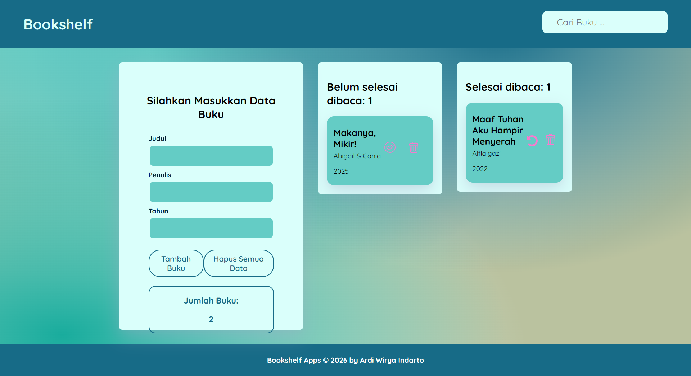

# Bookshelf Apps

Aplikasi pengelolaan data buku berbasis **DOM Manipulation** dan **Web Storage**, dibuat sebagai submission kelas [Belajar Membuat Front-End Web untuk Pemula](https://www.dicoding.com/academies/315) — Dicoding. Submission ini mendapat rating **4/5**.

## Preview

**Dashboard**



**Halaman Bookshelf**



## Tentang Aplikasi

Bookshelf Apps membantu pengguna mencatat buku yang sedang dibaca dan yang sudah selesai dibaca, tanpa memerlukan backend atau database — seluruh data disimpan langsung di browser menggunakan `localStorage`.

Aplikasi terdiri dari dua halaman:

- **Dashboard** (`index.html`) — halaman landing sederhana yang mengarahkan pengguna ke halaman utama aplikasi.
- **Bookshelf** (`bookshelf.html`) — halaman utama tempat seluruh fungsionalitas CRUD berjalan.

## Fitur

- **Tambah buku** — input judul, penulis, dan tahun terbit melalui form.
- **Dua rak otomatis** — buku terpisah ke rak "Belum selesai dibaca" dan "Selesai dibaca" berdasarkan status `isComplete`.
- **Pindah rak** — tombol centang untuk menandai selesai dibaca, dan tombol undo untuk mengembalikannya.
- **Hapus buku** — per item maupun hapus seluruh data sekaligus, dengan konfirmasi sebelum aksi dijalankan.
- **Pencarian real-time** — filter daftar buku langsung saat mengetik di kolom pencarian pada header.
- **Persistensi data** — data tersimpan di `localStorage` sehingga tetap ada meski browser ditutup.
- **Notifikasi toast** — feedback visual setiap kali data berhasil disimpan.
- **Penghitung jumlah buku** — total buku ditampilkan secara otomatis dan diperbarui secara real-time.

## Tech Stack

- HTML5 & CSS3 (custom, tanpa framework)
- JavaScript (vanilla) — DOM manipulation & custom event (`CustomEvent`)
- Web Storage API (`localStorage`)

## Struktur Proyek

```
bookshelf-apps/
├── index.html              # Halaman dashboard/landing
├── bookshelf.html          # Halaman utama aplikasi
├── main.js                 # Logic CRUD, render, dan localStorage
├── style-dashboard.css
├── style-bookshelf.css
└── assets/
    ├── dashboard.png
    ├── bookshelf.png
    ├── rakbuku.png
    ├── search.svg
    ├── check-outline.svg
    ├── check-solid.svg
    ├── trash-outline.svg
    ├── trash-fill.svg
    └── undo-outline.svg
```

## Menjalankan Aplikasi

Tidak memerlukan instalasi atau build tool. Buka `index.html` di browser, lalu klik tombol **"Ke Halaman Bookshelf"** untuk masuk ke halaman utama.

## Catatan

Karena data disimpan di `localStorage`, buku yang ditambahkan hanya tersimpan di browser dan perangkat yang sama — tidak ada sinkronisasi lintas perangkat.
